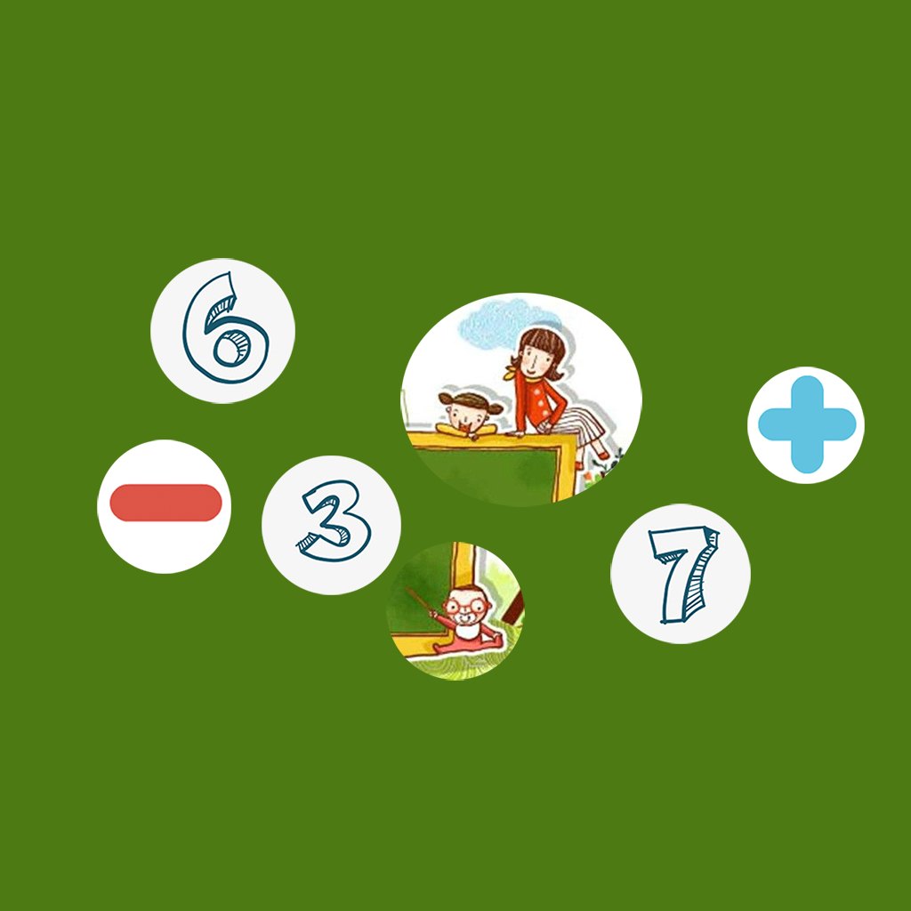

## Welcome to My Baby Arithmetic Fun Training

In the process of baby's growing up, as the closest parent to baby, we often teach children the simple use of number practice and arithmetic. This app can customize numbers and arithmetic of different difficulty according to baby's knowledge level, and add interesting ways to find boxes and numbers, hide the numbers in pictures and boxes. Baby needs to open the boxes and find the right numbers Fill in the blanks so that the equation holds. In this process, the parents can help the baby number and train the number arithmetic ability.

If you have any questions, you can either leave a message or send the questions to our email address.

We will answer them for you in the first time.

### Address: zhanghesongyuan7@126.com

Thank you!
